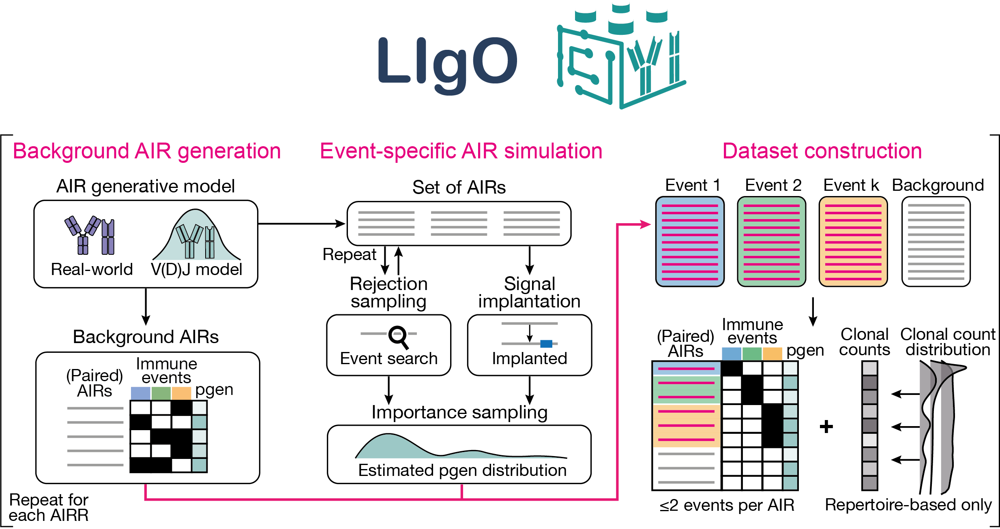

Welcome to the LIgO documentation!
======================================

LIgO is a Python tool for simulation of adaptive immune receptors (AIRs) and repertoires (AIRRs) with known ground-truth immune signals for the development and benchmarking of AIRR-based machine learning. To get started using LigO right now, check out our :doc:`quickstart` tutorial.

Why should you use LIgO?
---------------------------------
* LIgO makes **simulations reproducible**, all simulation parameters are specified through a YAML file. 
* LIgO contains **different types of immune events and immune signals**, including (gapped) k-mers, PWMs, specific V and J genes.
* LIgO supports simulation of signal-specific AIRs using **rejection sampling or signal implantation** and **preserves the AIRR generation probability distribution**.
* LIgO simulates synthetic AIRR (BCRs and TCRs) data both on the **receptor and repertoire level, the single and paired-chain level**.
* LIgO **guides the user** and helps to set optimal simulation parameters.
* LIgO outputs detailed information about presence and position(s) of immune signal(s) for every AIR in AIRR-compliant format.  

Please **check out LIgO manuscript** `(biorxiv link) <https://www.biorxiv.org/content/10.1101/2023.10.20.562936v2>`_ for more information!

Contents
---------------------------------

.. toctree::
  :maxdepth: 1

  quickstart
  installation
  tutorials
  usecases
  specification

