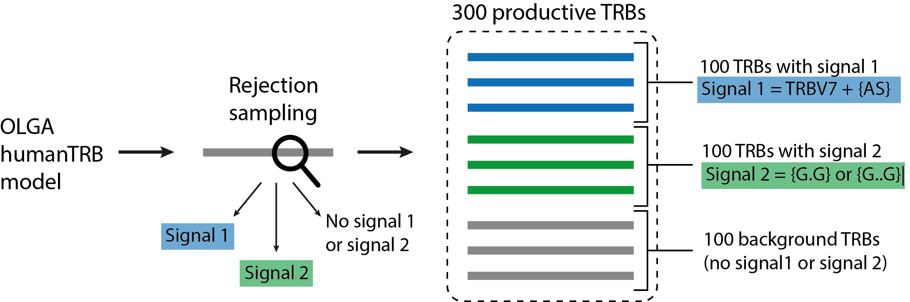

Quickstart
==========

How to run LIgO
---------------------------------

You can run LIgO in command line using the following command:

.. code-block:: console

  ligo specs.yaml output_folder

Where

* **specs.yaml** — simulation parameters described by the user in a yaml file. Please see XXX for more information about LIgO parameters.
* **output_folder** — output folder name defined by the user (should not exist before the run). 

How to use LIgO for receptor-level simulation
---------------------------------

Simulation of a TCR dataset containing 2 immune signals 
^^^^^^^^^^^^^^^^^^^^^^^^^^^^^^^^^

In this quickstart tutorial we will simulate a dataset of 300 productive TRB receptors — 100 TRBs containing signal1, 100 TRBs containing signal2, and 100 TRBs containing no immune signal (background receptors), see the illustration bellow. Signal 1 consists of a 2-mer {AS} and TRBV7, i.e., only TRBs containing both TRBV7 and 2-mer {AS} contain Signal1. Signal 2 consists of two gapped k-mers {G.G} and {G..G}.  Signal-specific TRBs will be generated using the rejection sampling strategy and the default OLGA model (humanTRB). 

TRBs will be reported as a triple of TRBV gene name, CDR3 AA sequence, and TRBJ gene name. If you also want to report the generation probabilities (pgen) of the simulated receptors according to the default OLGA humanTRB model, set the *export_p_gens* parameter to true. Please keep in mind, that pgen evaluation may take some time. 

Step 1: YAML specification
^^^^^^^^^^^^^^^^^^^^^^^^^^^^^^^^^

Now we need to define the YAML file describing the simulation parameters. We define the immune signal 1 and 2 and the number of TRBs per each signal in the **definitions** section and technical parameters of the simulation in the **instructions** section. You can read more about the yaml file parameters in :doc:`specification`.  

Here is the complete YAML specification for the simulation:

.. code-block:: yaml

  definitions:
    motifs:
      motif1:
        instantiation: GappedKmer
        seed: AS 
      motif2:
        instantiation:
          GappedKmer:
            max_gap: 2
            min_gap: 1
        seed: G/G
    signals:
      signal1:
        v_call: TRBV7
        motifs:
        - motif1
      signal2:
        motifs:
        - motif2
    simulations:
      sim1:
        is_repertoire: false
        paired: false
        sequence_type: amino_acid
        simulation_strategy: RejectionSampling
        sim_items:
          sim_item1: # group of sequences with same sim params
            generative_model:
              chain: beta
              default_model_name: humanTRB
              model_path: null
              type: OLGA
            number_of_examples: 100
            seed: 1002
            signals:
             signal1: 1
          sim_item2: # group of sequences with same sim params
            generative_model:
              chain: beta
              default_model_name: humanTRB
              model_path: null
              type: OLGA
            number_of_examples: 100
            seed: 2
            signals:
              signal2: 1 # all receptors will have the signal
          sim_item3: # group of sequences with same sim params
            generative_model:
              chain: beta
              default_model_name: humanTRB
              model_path: null
              type: OLGA
            number_of_examples: 100
            seed: 5231
            signals: {} # no signal -> background sequences
  instructions:
    my_sim_inst:
      export_p_gens: false # could take some time to compute
      max_iterations: 100
      number_of_processes: 4
      sequence_batch_size: 1000
      simulation: sim1
      store_signal_in_receptors: true
      type: LigoSim

Step 2: Running LIgO
^^^^^^^^^^^^^^^^^^^^^^^^^^^^^^^^^

After saving the yaml specification to a file (e.g., quickstart.yaml), you can proceed with the analysis by following these steps:

#. Activate the virtual environment where you have installed LIgO, for example

.. code-block:: console

  source ligo_env/bin/activate
  
#. Navigate to the directory where the yaml specification (quickstart.yaml) was saved.

#. Execute the following command:

.. code-block:: console

  ligo quickstart.yaml quickstart_output
  
Note that the output folder (quickstart_output) should not exist before the run.

Step 3: Understanding the output
^^^^^^^^^^^^^^^^^^^^^^^^^^^^^^^^^

Next steps
^^^^^^^^^^^^^^^^^^^^^^^^^^^^^^^^^

How to use LIgO for reperoire-level simulation
---------------------------------

Step 1: YAML specification
^^^^^^^^^^^^^^^^^^^^^^^^^^^^^^^^^

Step 2: Running LIgO
^^^^^^^^^^^^^^^^^^^^^^^^^^^^^^^^^

Step 3: Understanding the output
^^^^^^^^^^^^^^^^^^^^^^^^^^^^^^^^^

Next steps
^^^^^^^^^^^^^^^^^^^^^^^^^^^^^^^^^
