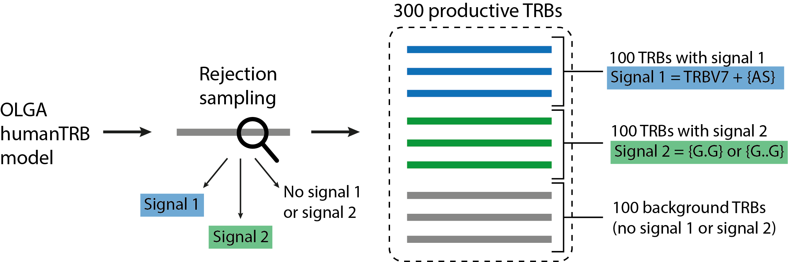

Quickstart
==========

How to run LIgO
---------------------------------

You can run LIgO in command line using the following command:

.. code-block:: console

  ligo specs.yaml output_folder

Where

* **specs.yaml** — simulation parameters described by the user in a yaml file. Please see XXX for more information about LIgO parameters.
* **output_folder** — output folder name defined by the user (should not exist before the run). 

How to use LIgO for receptor-level simulation
---------------------------------

Simulation of a TCR dataset containing 2 immune signals 
^^^^^^^^^^^^^^^^^^^^^^^^^^^^^^^^^

In this quickstart tutorial we will simulate a dataset of 300 productive TRB receptors — 100 TRBs containing signal1, 100 TRBs containing signal2, and 100 TRBs containing no immune signal (background receptors), see the illustration bellow. Signal 1 consists of a 2-mer {AS} and TRBV7, i.e., only TRBs containing both TRBV7 and 2-mer {AS} contain Signal1. Signal 2 consists of two gapped k-mers {G.G} and {G..G}.  Signal-specific TRBs will be generated using the rejection sampling strategy and the default OLGA model (humanTRB). 

TRBs will be reported as a triple of TRBV gene name, CDR3 AA sequence, and TRBJ gene name. If you also want to report the generation probabilities (pgen) of the simulated receptors according to the default OLGA humanTRB model, set the *export_p_gens* parameter to true. Please keep in mind, that pgen evaluation may take some time. 

YAML specification
^^^^^^^^^^^^^^^^^^^^^^^^^^^^^^^^^

Expected output
^^^^^^^^^^^^^^^^^^^^^^^^^^^^^^^^^

How to use LIgO for reperoire-level simulation
---------------------------------
