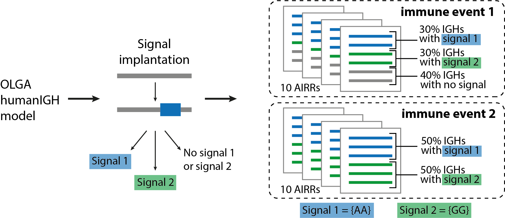

How to use LIgO for repertoire-level simulation
-------------------------------------------------

Simulation of BCR repertoires labeled with two immune events
==============================================================

In this quickstart tutorial, we will generate a dataset of 20 BCR repertoires, with each repertoire containing 6 BCRs, as follows (see the illustration below):

- 10 repertoires labeled as immune event 1 and consist of 30% BCRs with signal 1 and 30% BCRs with signal 2;

- 10 repertoires labeled as immune event 2 and consist of 50% BCRs with signal 1 and 50% BCRs with signal 2. 

We define signal 1 and signal 2 as follows (see the illustration below):

- Signal 1 is composed of a 2-mer {AA};

- Signal 2 is composed of a 2-mer {GG}. 

Signal-specific BCRs will be generated using the signal implantation strategy, where any implanting position is allowed, and the default OLGA model (humanIGH). If you also want to report the generation probabilities (pgen) of the simulated receptors according to the default OLGA humanTRB model, set the :code:`export_p_gens` parameter to true. Please keep in mind that pgen evaluation may take time. 

Step 1: YAML specification
==============================================================

LIgO simulation starts with defining the YAML file with the simulation parameters. First, we define the immune signals 1 and 2 in the **definitions** section. You can read more about the yaml file parameters in :ref:`YAML specification`.

.. code-block:: yaml

  definitions:
    motifs:
      motif1:
        seed: AA
      motif2:
        seed: GG
    signals:
      signal1:
        motifs: [motif1]
      signal2:
        motifs: [motif2]

Second, we define the immune events and the repertoire parameters, such as the number of repertoires and the number of BCRs in the repertoire, in the **simulations** section. You can read more about the yaml file parameters in :ref:`YAML specification`.

.. code-block:: yaml

  simulations:
    sim1:
      is_repertoire: true
      paired: false
      sequence_type: amino_acid
      simulation_strategy: Implanting
      remove_seqs_with_signals: true # remove signal-specific AIRs from the background
      sim_items: # group of AIRs with the same parameters
      AIRR1:
        immune_events:
          ievent1: True
          ievent2: False
        signals: {signal1: 0.3, signal2: 0.3}
        number_of_examples: 10
        is_noise: False
        receptors_in_repertoire_count: 6
        generative_model:
          chain: heavy
          default_model_name: humanIGH
          model_path: null
          type: OLGA
      AIRR2:
        immune_events:
          ievent1: False
          ievent2: True
        signals: {signal1: 0.5, signal2: 0.5}
        number_of_examples: 10
        is_noise: False
        receptors_in_repertoire_count: 6
        generative_model:
          chain: heavy
          default_model_name: humanIGH
          model_path: null
          type: OLGA

Finally, we define the technical parameters of the simulation in the **instructions** section. You can read more about the yaml file parameters in :ref:`YAML specification`.

.. code-block:: yaml

  instructions:
    my_sim_inst:
      export_p_gens: false
      max_iterations: 100
      number_of_processes: 4
      sequence_batch_size: 1000
      simulation: sim1
      type: LigoSim

Here is the complete YAML specification for the simulation:

.. code-block:: yaml

  definitions:
    motifs:
      motif1:
        seed: AA
      motif2:
        seed: GG
    signals:
      signal1:
        motifs: [motif1]
      signal2:
        motifs: [motif2]
    simulations:
      sim1:
        is_repertoire: true
        paired: false
        sequence_type: amino_acid
        simulation_strategy: Implanting
        remove_seqs_with_signals: true # remove signal-specific AIRs from the background
        sim_items: # groups of AIRs with the same parameters
          AIRR1:
            immune_events:
              ievent1: True
              ievent2: False
            signals: {signal1: 0.3, signal2: 0.3}
            number_of_examples: 10
            is_noise: False
            receptors_in_repertoire_count: 6
            generative_model:
              chain: heavy
              default_model_name: humanIGH
              model_path: null
              type: OLGA
          AIRR2:
            immune_events:
              ievent1: False
              ievent2: True
            signals: {signal1: 0.5, signal2: 0.5}
            number_of_examples: 10
            is_noise: False
            receptors_in_repertoire_count: 6
            generative_model:
              chain: heavy
              default_model_name: humanIGH
              model_path: null
              type: OLGA
  instructions:
    my_sim_inst:
      export_p_gens: false
      max_iterations: 100
      number_of_processes: 4
      sequence_batch_size: 1000
      simulation: sim1
      type: LigoSim

Step 2: Running LIgO
==============================================================
After saving the yaml specification to a file (e.g., `quickstart_repertoire.yaml`), you can proceed with the analysis by following these steps:

#. Activate the virtual environment where you have installed LIgO, for example

.. code-block:: console

  source ligo_env/bin/activate
  
#. Navigate to the directory where the yaml specification (`quickstart_repertoire.yaml`) was saved.

#. Execute the following command:

.. code-block:: console

  ligo quickstart_repertoire.yaml quickstart_output_repertoire
  
All results will be located in quickstart_output_repertoire. Note that the output folder (quickstart_output_repertoire) should not exist prior to the run.

Step 3: Understanding the output
==============================================================

Next steps
==============================================================

- For a quickstart guide on receptor-level simulation see :ref:`How to use LIgO for receptor-level simulation`. 

- Other tutorials for how to use LIgO can be found under :ref:`Tutorials`.

- You can find more information about yaml parameters in :ref:`YAML specification`. 
