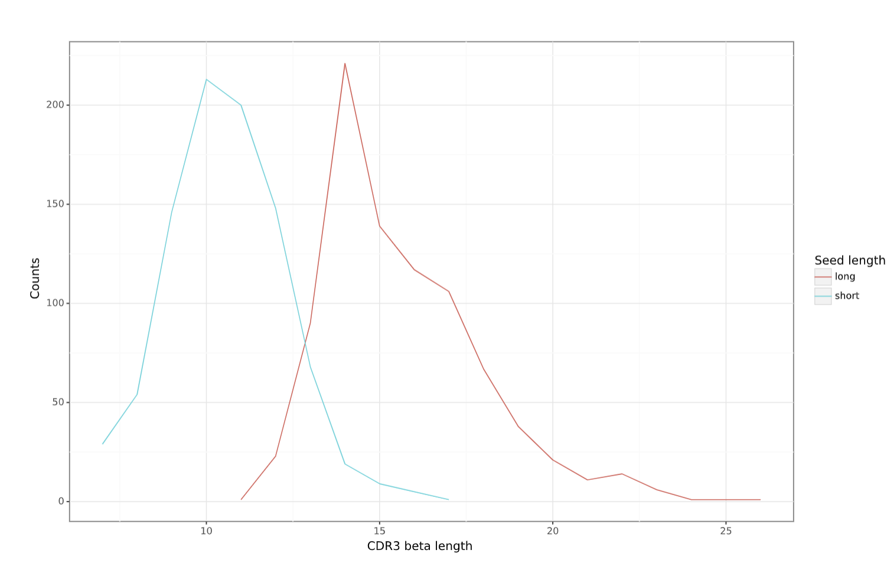

Constructing LIgO motifs inspired by a database of TCR sequences with known antigen specificities
===================================================

LIgO enables the generation of motifs using either (i) a combination of a short amino acid sequence (i.e., a seed) and a list of Hamming distances, representing the allowed deviations from the seed or (ii) a position weight matrix (PWM). In this tutorial, we demonstrate how one can use a database of TCRs with known antigen specificities to construct more biologically-relevant LIgO motifs. These database-inspired motifs can be used to simulate epitope-specific TCR data, i.e., a collection of TCRs derived from different individuals that are all recognizing the same epitope. 

.. note::

   LIgO-simulated data can only resemble the general structure of epitope-specific TCRs. The actual specificities of these TCRs cannot be simulated, and thus the final simulated data are not guaranteed to contain only TCRs recognizing the same epitope. Otherwise, the problem of predicting epitope-TCR binding would be solved, and no models should be trained anymore.

In this tutorial, we will suggest two approaches for constructing database-inspired LIgO motifs:

1. `Basic approach: defining motifs based on a seed and a list of Hamming distances <#basic-approach:-defining-motifs-based-on-a-seed-and-a-list-of-Hamming-distances>`_

2. `Enhanced approach: defining motifs based on PWM <#enhanced-approach:-defining-motifs-based-on-pwm>`_

In both approaches we will use the VDJdb database (Shugay et al., 2018; Goncharov et al., 2022) to obtain epitope-specific TCRs. However, there are more databases available, such as 

- `McPAS <https://friedmanlab.weizmann.ac.il/McPAS-TCR/>`_ (Tickotsky et al., 2017) 

- `IEDB <https://www.iedb.org/>`_  (Vita et al., 2019) 

- `ATLAS <https://atlas.wenglab.org/web/>`_  (Borrman et al., 2017) 

- `TCRdb <http://bioinfo.life.hust.edu.cn/TCRdb/#/>`_  (Chen et al., 2021) 

Basic approach: defining motifs based on a seed and a list of Hamming distances
---------------------------------------

**Step 1: Constructing seeds from the VDJdb receptors**

For demonstration purposes, we define three seeds from three TCR beta sequences in the VDJdb (Shugay et al. 2018), all recognizing the DENV3/4 epitope GTSGSPIINR (Table 1). To transform these TCRs into seeds, they need to be shrinked. Typically, the epitope-binding motif is located in the middle of CDR3 beta sequences, while the beginning and end are responsible for HLA-binding. Therefore, the center of the CDR3 beta sequence can be used as seed. In this tutorial, we will consider two ways of constructing seeds: *long seeds* and *short seeds*.

- To construct *long seeds* we removed the first and the last 3 amino acids were removed from the CDR3 sequence;

- To construct *short seeds* we randomly selected a consecutive substring of 3 amino acid long out of the long seed sequence in such way, that the resulting seeds are not too similar.

Table 1 shows the long and short seeds that were selected for the three initial TCRs. We will use these two seed sets to perform two LIgO simulations, keeping all other simulation parameters identical except for the seeds.

.. list-table:: Table 1: Examples of the long and short seeds
  :header-rows: 1

  * - TCR beta sequence
    - TRBV gene
    - TRBJ gene
    - Epitope
    - Long Seed
    - Short Seed
  * - CSVELSGINQPQHF
    - TRBV29-1
    - TRBJ1-5
    - GTSGSPIINR
    - ELSGINQP
    - SGI
  * - CASSPAGGTYEQYF
    - TRBV11-2
    - TRBJ2-7
    - GTSGSPIINR
    - SPAGGTYE
    - PAG
  * - CASSGGDVREEQYF
    - TRBV9
    - TRBJ2-7
    - GTSGSPIINR
    - SGGDVREE
    - DVR

**Step 2: Defining LIgO motifs based on the seeds**

After describing the seeds, it is required to define possible deviations that are allowed from these seeds using hamming distance. To select the maximum hamming distance, consider the length of your seed and the aimed diversity of the final TCR repertoire. 

.. note::
Shorter seeds require lower hamming distances. However, if one only wishes to simulated TCRs looking very similar to the seed, one can also lower the hamming distance. 

In this tutorial, a maximum hamming distance of two was selected so that the diversity of the simulated epitope-specific TCR receptors does not become too large. Below we show an example of how to define motifs using haming distance and long seeds. These signals can be further used for LIgO simulation based on rejection sampling or signal implantation.

.. code-block:: yaml

 motifs:
    motif1:
      hamming_distance_probabilities:
        0: 0.1 # 10% of TCRs will contain ELSGINQP as the exact match 
        1: 0.2 # 20% of TCRs will contain ELSGINQP with 1 mismatch 
        2: 0.7 # 70% of TCRs will contain ELSGINQP with 2 mismatch 
      seed: ELSGINQP
    motif2:
      hamming_distance_probabilities:
        0: 0.1 # 10% of TCRs will contain SPAGGTYE as the exact match 
        1: 0.2 # 20% of TCRs will contain SPAGGTYE with 1 mismatch 
        2: 0.7 # 70% of TCRs will contain SPAGGTYE with 2 mismatch
      seed: SPAGGTYE
    motif3:
      hamming_distance_probabilities:
        0: 0.1 # 10% of TCRs will contain SGGDVREE as the exact match
        1: 0.2 # 20% of TCRs will contain SGGDVREE with 1 mismatch 
        2: 0.7 # 70% of TCRs will contain SGGDVREE with 2 mismatch
      seed: SGGDVREE

**General tips for defining a motif using a seed and Hamming distance:**

#. Start with the full seed you want to find back in your simulated TCRs, e.g., ELSGINQP

#.  If you want to use rejection sampling, estimate the maximal hamming distance to finish your simulation in a reasonable time. You can start with a very restrictive hamming distance (e.g. max 1) and adjust it as needed. You can use the feasibility report to estimate the effectiveness of the simulation with a given set of parameters, see :ref:`How to check feasibility of the simulation parameters`.   

    For example, in this tutorial we used the following rule of the thumb:

    - Seed length of 6-8 => max Hamming distance = 2

    - Seed length of 9-10 => max Hamming distance = 3

    - Seed length >10 => test the simulation with a maximal hamming distance of 3. If not enough TCR are simulated, increase the max hamming distance up to 4.

    If you want to use implanting, you do not need to estimate the feasibility because the simulation will be fast with any Hamming distance.

#. Start the simulation with the selected seed and Hamming distances. Check for the presence of the predefined motif in the simulated TCRs by clustering or allocating the seed within the TCR sequences.

**Observations:** 

1. A large allowance for hamming distance may impact the identification of the seed sequences when simulated with shorter seeds

Tables 2 and 3 present examples of simulated TCRs for the long and short seed simulations, respectively. As expected, most of the amino acids in the original long seed are retained, with only a few positions changed. The opposite is true for the short seeds. Since we allowed up to two Hamming distances for a seed of three amino acids, it is a challenge to identify the original seed within the simulated TCRs.

.. list-table:: Table 2: Examples of simulated TCRs with long seeds
  :header-rows: 1

  * - junction_aa
    - seed_match
    - hamming_distance
    - seed
  * - CAAGDRSGINQPQHF
    - DRSGINQP
    - 2
    - ELSGINQP
  * - CACTELAGGNQPQHF
    - ELAGGNQP
    - 2
    - ELSGINQP
  * - CAIASGGRVREQFF
    - SGGRVREQ
    - 1
    - SGGDVREE
  * - CAIQGTSGGAIREETQYF
    - SGGAIREE
    - 2
    - SGGDVREE
  * - CAIICPGGGTYEQYF
    - CPGGGTYE
    - 2
    - SPAGGTYE
  * - CAIPSPCGGCYEQYF
    - SPCGGCYE
    - 2
    - SPAGGTYE

.. list-table:: Table 3: Examples of simulated TCRs with short seeds
  :header-rows: 1

  * - junction_aa
    - seed_match
    - hamming_distance
    - seed
  * - CAAELLEQYF
    - AAE
    - 2
    - PAG
  * - CACCNCQPQHF
    - PQH
    - 2
    - PAG
  * - CACDTLNEQYF
    - DTL
    - 2
    - DVR
  * - CACEWRYNEQFF
    - EWR
    - 2
    - DVR
  * - CACILEKLFF
    - ACI
    - 2
    - SGI

2. Hamming distance and seed length may affect the similarity between simulation seeds and simulated TCR cluster concensuses

We used ClustTCR (Valkiers et al., 2021) to investigate the architecture of the simulated TCRs by clustering their CDR3s with up to one allowed amino acid difference. The TCRs simulated with two different sets of seeds were clustered separately, and for each cluster, a motif summarizing the consensus sequence was calculated. The motifs for the 10 largest clusters are provided in tables 4 and 5 for the long and short seed simulation, respectively.

When simulating the TCRs with long seeds, we observe a clear overlap between the clusTCR motifs and the original seeds. This indicates successful simulation of the original motif within the receptors. However, in the case of simulating epitope-specific TCRs using short seeds, we find that these seeds are not well represented within the clusTCR motifs. The clustering may be influenced by other common similarities outside of the predefined motif, leading to a loss of track of the original motif after simulation.

.. note::

Seed length and allowed hamming distance both have an impact on the final results. Even with long seeds, unwanted results can occur if the hamming distances are set too high. As a general recommendation, we advise clustering the simulated receptors in case the exact presence of motifs is required for your study.

.. list-table:: Table 4: Motifs of the 10 largest clusters in the simulated TCRs with large seeds
  :header-rows: 1

  * - CDR3 Motif
    - Seed
    - Cluster size
  * - CASSp.GGtYEQYF
    - SPAGGTYE
    - 59
  * - CASSLSG.NQPQHF
    - ELSGINQP
    - 16
  * - CASSL.GINQPQHF
    - ELSGINQP
    - 9
  * - CASSAGG.YEQYF
    - SPAGGTYE
    - 7
  * - CASSGG.VRYEQYF
    - SGGDVREE
    - 6
  * - CASP[GP]GG.YEQYF
    - SPAGGTYE
    - 6
  * - CASSE.SGSNQPQHF
    - ELSGINQP
    - 5
  * - CASSPGtGTYEQYF
    - SPAGGTYE
    - 4
  * - CASSvAGGTGELFF
    - SPAGGTYE
    - 4

.. list-table:: Table 5: Motifs of the 10 largest clusters in the simulated TCRs with short seeds
  :header-rows: 1

  * - CDR3 Motif
    - Seed
    - Cluster size
  * - CA..YEQYF
    - PAG,DVR,SGI
    - 15
  * - CAs.yEQYF
    - PAG,DVR,SGI
    - 14
  * - CA.T[AP]YEQYF
    - PAG,DVR
    - 9
  * - CArDEQYF
    - DVR
    - 8
  * - CAS..ETQYF
    - SGI
    - 8
  * - CAS.tYEQYF
    - SGI
    - 6
  * - C[RT]DYEQYF
    - DVR
    - 5
  * - CA[KT][SR]ETQYF
    - DVR,SGI
    - 5
  * - C[GV]G[QL]YEQYF
    - SGI
    - 5
  * - CAR.TDTQYF
    - DVR
    - 5

3. TCRs simulated with a short seed have shorter CDR3s compared to TCRs simulated with long seeds

We also compared the distribution of CDRR3 length (in amino acids) between the TCRs generated with short and long motifs (shown in blue and red, respectively). Our observation indicates that TCRs generated with long motifs tend to be longer than those generated with short motifs.

Enhanced approach: defining motifs based on PWM 
---------------------------------------

