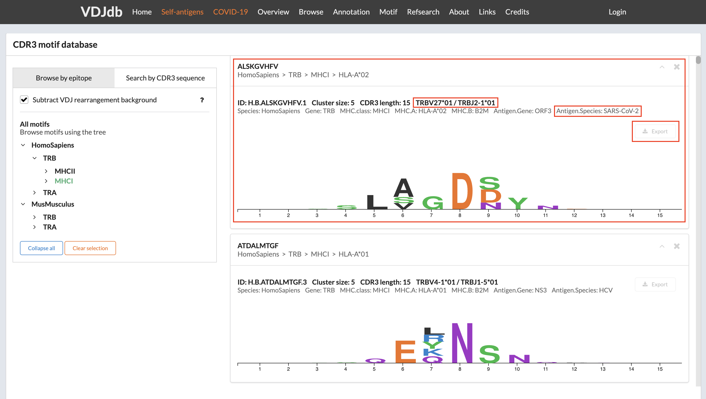

Constructing LIgO motifs inspired by a database of TCR sequences with known antigen specificities
===================================================

LIgO enables the generation of motifs using either (i) a combination of a short amino acid sequence (i.e., a seed) and a list of Hamming distances, representing the allowed deviations from the seed or (ii) a position weight matrix (PWM). 

In this tutorial, we demonstrate how one can use a database of TCRs with known antigen specificities to construct more biologically-relevant LIgO motifs. These database-inspired motifs can be used to simulate epitope-specific TCR data, i.e., a collection of TCRs derived from different individuals that are all recognizing the same epitope. 

We suggest two approaches for constructing database-inspired LIgO motifs:

#. :ref:`Basic approach: defining motif based on a seed and a list of Hamming distances`

#. :ref:`Enhanced approach: defining motif based on PWM`

In both approaches we will use the  `VDJdb database <https:vdjdb.cdr3.net/>`_  (Shugay et al., 2018; Goncharov et al., 2022) to obtain epitope-specific TCRs. However, there are more databases available, such as 

- `McPAS <https://friedmanlab.weizmann.ac.il/McPAS-TCR/>`_ (Tickotsky et al., 2017) 

- `IEDB <https://www.iedb.org/>`_  (Vita et al., 2019) 

- `ATLAS <https://atlas.wenglab.org/web/>`_  (Borrman et al., 2017) 

- `TCRdb <http://bioinfo.life.hust.edu.cn/TCRdb/#/>`_  (Chen et al., 2021) 

Basic approach: defining motif based on a seed and a list of Hamming distances
---------------------------------------

Step 1: Constructing seeds from the VDJdb receptors
*************

For demonstration purposes, we define three seeds from three TCR beta sequences in the VDJdb (Shugay et al. 2018), all recognizing the DENV3/4 epitope GTSGSPIINR (Table 1). To transform these TCRs into seeds, they need to be shrinked. Typically, the epitope-binding motif is located in the middle of CDR3 beta sequences, while the beginning and end are responsible for HLA-binding. Therefore, the center of the CDR3 beta sequence can be used as seed. In this tutorial, we will consider two ways of constructing seeds: *long seeds* and *short seeds*.

- To construct *long seeds* we removed the first and the last 3 amino acids were removed from the CDR3 sequence;

- To construct *short seeds* we randomly selected a consecutive substring of 3 amino acid long out of the long seed sequence in such way, that the resulting seeds are not too similar.

Table 1 shows the long and short seeds that were selected for the three initial TCRs. We will use these two seed sets to perform two LIgO simulations, keeping all other simulation parameters identical except for the seeds.

.. list-table:: Table 1: Examples of the long and short seeds
  :header-rows: 1

  * - TCR beta sequence
    - TRBV gene
    - TRBJ gene
    - Epitope
    - Long Seed
    - Short Seed
  * - CSVELSGINQPQHF
    - TRBV29-1
    - TRBJ1-5
    - GTSGSPIINR
    - ELSGINQP
    - SGI
  * - CASSPAGGTYEQYF
    - TRBV11-2
    - TRBJ2-7
    - GTSGSPIINR
    - SPAGGTYE
    - PAG
  * - CASSGGDVREEQYF
    - TRBV9
    - TRBJ2-7
    - GTSGSPIINR
    - SGGDVREE
    - DVR

Step 2: Defining LIgO motifs based on the seeds
*************

After describing the seeds, it is required to define possible deviations that are allowed from these seeds using hamming distance. To select the maximum hamming distance, consider the length of your seed and the aimed diversity of the final TCR repertoire. 

.. note::
Shorter seeds require lower hamming distances. However, if one only wishes to simulated TCRs looking very similar to the seed, one can also lower the hamming distance. 

In this tutorial, a maximum hamming distance of two was selected so that the diversity of the simulated epitope-specific TCR receptors does not become too large. Below we show an example of how to define motifs using haming distance and long seeds. These signals can be further used for LIgO simulation based on rejection sampling or signal implantation.

.. code-block:: yaml

 motifs:
    motif1:
      hamming_distance_probabilities:
        0: 0.1 # 10% of TCRs will contain ELSGINQP as the exact match 
        1: 0.2 # 20% of TCRs will contain ELSGINQP with 1 mismatch 
        2: 0.7 # 70% of TCRs will contain ELSGINQP with 2 mismatch 
      seed: ELSGINQP
    motif2:
      hamming_distance_probabilities:
        0: 0.1 # 10% of TCRs will contain SPAGGTYE as the exact match 
        1: 0.2 # 20% of TCRs will contain SPAGGTYE with 1 mismatch 
        2: 0.7 # 70% of TCRs will contain SPAGGTYE with 2 mismatch
      seed: SPAGGTYE
    motif3:
      hamming_distance_probabilities:
        0: 0.1 # 10% of TCRs will contain SGGDVREE as the exact match
        1: 0.2 # 20% of TCRs will contain SGGDVREE with 1 mismatch 
        2: 0.7 # 70% of TCRs will contain SGGDVREE with 2 mismatch
      seed: SGGDVREE

General tips for defining a motif using a seed and Hamming distance
*************

#. Start with the full seed you want to find back in your simulated TCRs, e.g., ELSGINQP

#.  If you want to use rejection sampling, estimate the maximal hamming distance to finish your simulation in a reasonable time. You can start with a very restrictive hamming distance (e.g. max 1) and adjust it as needed. You can use the feasibility report to estimate the effectiveness of the simulation with a given set of parameters, see :ref:`How to check feasibility of the simulation parameters`.   

    For example, in this tutorial we used the following rule of the thumb:

    - Seed length of 6-8 => max Hamming distance = 2

    - Seed length of 9-10 => max Hamming distance = 3

    - Seed length >10 => test the simulation with a maximal hamming distance of 3. If not enough TCR are simulated, increase the max hamming distance up to 4.

    If you want to use implanting, you do not need to estimate the feasibility because the simulation will be fast with any Hamming distance.

#. Start the simulation with the selected seed and Hamming distances. Check for the presence of the predefined motif in the simulated TCRs by clustering or allocating the seed within the TCR sequences.

Enhanced approach: defining motif based on PWM 
---------------------------------------

Option 1: VDJdb CDR3 motif database
*************

VDJdb provides a database of CDR3 motifs, which you can access at https://vdjdb.cdr3.net/motif to find suitable motifs. You can search for motifs based on an epitope or a CDR3 sequence or subsequence.

The figure below showcases a SARS-CoV-2-specific motif from VDJdb. This SARS-CoV-2-specific TCRs must have 15 amino acids long CDR3 and use the germline genes TRBV27*01 and TRBJ2-1*1.

After clicking the Export button, you will receive a TSV file containing all the members representing the given motif. To convert the set of CDR3s into a PWM compatible with LIgO, you can use the following code:

.. code-block:: python

  import numpy as np
  import pandas as pd
  from Bio.Align import MultipleSeqAlignment
  from Bio.Seq import Seq
  from Bio.SeqRecord import SeqRecord
  
  df = pd.read_csv('ClusterMembers_H.A.IVTDFSVIK.tsv', sep='\t')
  sequences = [SeqRecord(Seq(seq)) for seq in df['cdr3aa'].tolist()]
  alignment = MultipleSeqAlignment(sequences)
  
  # construct PWM
  amino_acids = 'ACDEFGHIKLMNPQRSTVWY'
  aa_to_index = {aa: i for i, aa in enumerate(amino_acids)}
  
  alignment_matrix = np.array([[aa_to_index.get(aa, -1) for aa in record.seq] for record in alignment])
  
  pwm_matrix = np.array([
      np.bincount(alignment_matrix[:, pos][alignment_matrix[:, pos] >= 0], minlength=len(amino_acids))
      for pos in range(alignment.get_alignment_length())
  ]) / len(sequences)

  # export PWM as csv
  pwm_df = pd.DataFrame(pwm_matrix, columns=list(amino_acids))
  pwm_df.to_csv('pwm.csv')

Finally, the motif file pwm.csv can be used to define LIgO signal. Additional CDR3 length restricrion (15AA) can be added using the sequence_len_limits parameter in the simulation config item

.. code-block:: yaml

 motifs:
   sars-cov-2_motif:
     file_path: pwm.csv
        threshold: 2 # the threshold to consider the sequence as containing the motif, can be changed
 signals:
    signal1:
      v_call: TRBV27*01
      j_call: TRBJ2-1*01
      motifs: [sars-cov-2_motif]

Option 2: Database clustering by the user
*************

Alternatively, one can cluster VDJdb (or any other database) to obtain PWMs for LIgO simulation. In this tutorial we demonstrate how to cluster VDJdb database using the clusTCR tool (Valkiers et al., 2021). For more information on clusTCR, see `clusTCR documentation <https://svalkiers.github.io/clusTCR/>`_.

