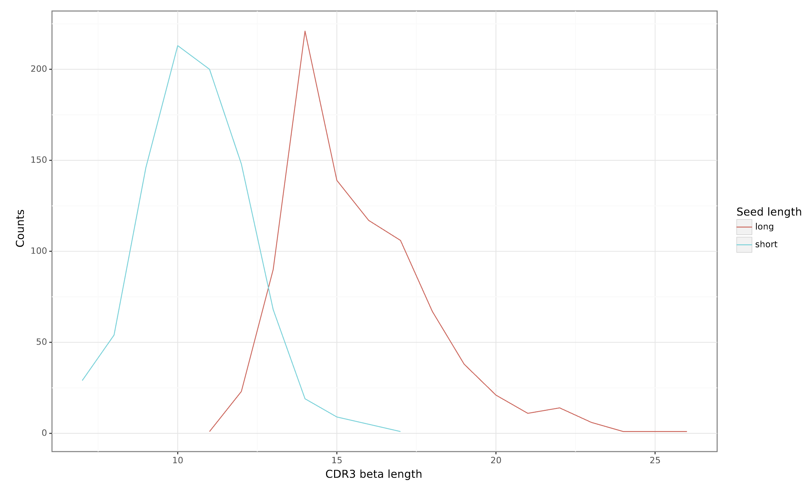

Simulating epitope-specific TCRs and validating their properties 
===================

During the development of a new epitope-TCR prediction method, it might be useful to simulate training data to test it or study potential biases in model performance. In this tutorial, we simulate epitope-specific TCR data, i.e., a collection of TCRs derived from different individuals that are all recognizing the same epitope. 
 
In this tutorial, epitope-specific TCR beta receptors are simulated from three user-defined motifs, which are considered to describe the subsequences within TCRs that are epitope-specific. Next, we ensure that the simulated data is biologically relevant by comparing the simulated TCRs to the experimental epitope-specific data. This use case is inspired by the manucript **“Revealing the hidden sequence distribution of epitope-specific TCR repertoires and its influence on machine learning model performance”**, see the manuscript text (`biorxiv <https://www.biorxiv.org/content/10.1101/2024.10.21.619364v1>`_) for more details. 

Simulating of the epitope-specific TCRs
-------------------------

We defined an epitope-specific motif using the long seeds created in the previous tutorial :ref:`Constructing LIgO motifs inspired by a database of TCR sequences with known antigen specificities` (other details on transforming known epitope-specific TCRs from VDJdb into LIgO motifs can be found in the same tutorial). The rejection sampling method was used to avoid introducing additional artifacts to LIgO-simulated TCRs. 

The yaml file below describes simulation parameters used for LIgO simulation. You can find more details on how the parameters for the simulation were chosen in the tutorial :ref:`Constructing LIgO motifs inspired by a database of TCR sequences with known antigen specificities` and find more information about how to run receptor-level simulation using the quickstart :ref:`How to use LIgO for receptor-level simulation`.
  
.. code-block:: yaml

  definitions:
    motifs: # define motifs based on long seeds
      motif1:
        hamming_distance_probabilities:
          0: 0.1
          1: 0.2
          2: 0.7
        seed: ELSGINQP
      motif2:
        hamming_distance_probabilities:
          0: 0.1
          1: 0.2
          2: 0.7
        seed: SPAGGTYE 
      motif3:
        hamming_distance_probabilities:
          0: 0.1
          1: 0.2
          2: 0.7
        seed: SGGDVREE 
    signals:
      signal1:
        motifs:
        - motif1
        sequence_position_weights:
          '104': 0 # we did not want to start the motif at the first position, i.e. IMGT position 104
      signal2:
        motifs:
        - motif2
        sequence_position_weights:
          '104': 0 # we did not want to start the motif at the first position, i.e. IMGT position 104
      signal3:
        motifs:
        - motif3
        sequence_position_weights:
          '104': 0 # we did not want to start the motif at the first position, i.e. IMGT position 104
    simulations:
      sim1:
        is_repertoire: false
        paired: false
        sequence_type: amino_acid
        simulation_strategy: RejectionSampling
        sim_items:
          var1:
            generative_model:
              default_model_name: humanTRB
              type: OLGA
            is_noise: false
            number_of_examples: 300 # simulate 300 TCRs 
            signals: 
              signal1: 1 # all TCRs having signal1
          var2:
            generative_model:
              default_model_name: humanTRB
              type: OLGA
            is_noise: false
            number_of_examples: 300 # simulate 300 TCRs 
            signals:
              signal2: 1 # all TCRs having signal2
          var3:
            generative_model:
              default_model_name: humanTRB
              type: OLGA
            is_noise: false
            number_of_examples: 300 # simulate 300 TCRs 
            signals:
              signal3: 1 # all TCRs having signal3
  instructions:
    inst1:
      export_p_gens: false
      max_iterations: 2000
      number_of_processes: 8
      sequence_batch_size: 10000
      simulation: sim1
      type: LigoSim
  output:
    format: HTML

Inspecting the simulated TCRs
------------------------------
LIgO-simulated data can only resemble the general structure of epitope-specific TCRs. The actual specificities of these TCRs cannot be simulated, and thus the final simulated data are not guaranteed to contain only TCRs recognizing the same epitope. Otherwise, the problem of predicting epitope-TCR binding would be solved, and no models should be trained anymore. However, several methods can be used to validate LIgO-simulated data and compare it to the experimental data:

Method 1: Validating that LIgO-simulated clusters accurately represent immune signals
^^^^^^^^^^^^^^^^^^^

While LIgO ensures that each signal-specific receptor includes an immune signal, the distribution of these signals in the final repertoire may occasionally diverge from the initial definition. For example, if a signal k-mer allows for a large Hamming distance, it could introduce high variations in the data and thus the initial k-mer signal would be lost.

To address this, we recommend verifying that the motifs in the final dataset accurately reflect the initial LIgO motifs.

**How to verify motif in LIgO-simulated data:**

1. Cluster the simulated data. Any clustering method can be utilized, in this tutorial we demonstrate clustering using the clusTCR tool (Valkiers et al., 2021). See the script below for more details

2. Compare cluster motifs to initial LIgO motifs. This comparison will reveal if the final repertoire accurately captures the initial immune signals.

.. code-block:: python

  from clustcr import Clustering
  import pandas as pd
  
  # Read LIgO-simulated data
  data = pd.read_csv('./sim/inst1/exported_dataset/airr/batch1.tsv', sep='\t')

  # Cluster training data for selected epitope using clusTCR
  clustering = Clustering(method='MCL')
  clustered_data = clustering.fit(data['junction_aa'])
  
  # Save clusTCR motifs sorted by cluster size
  motifs = clustered_data.summary()
  motifs = motifs.sort_values(by='size', ascending=False)
  motifs.to_csv('clustcr_motifs.csv', index=False)

The clustcr_motifs.csv file will contain motifs saved in clusTCR format. You can read more about clusTCR motif format in the `clusTCR documentation <https://svalkiers.github.io/clusTCR/>`_. Briefly, the motif uses upper-case for highly conserved amino acids (frequency > 0.7) and lower-case for moderately conserved ones. If two amino acids are equally frequent, they’re in brackets ([ ]), and less significant positions use a dot (.) as a wildcard.

The motifs for the 10 largest clusters are given in the table 1 below. We can see a clear overlap between the clusTCR motifs and the original seeds. Thus, the original motif has been successfully simulated within the entire repertoire using long seeds.

.. list-table:: Table 1: ClusTCR motifs of top-10 largest clusters when TCR dataset is simulated using long seeds
  :header-rows: 1

  * - clusTCR motif
    - LIgO seed
    - cluster size
  * - CASSp.GGtYEQYF
    - SPAGGTYE
    - 59
  * - CAS[SR].gGTYEQYF
    - SPAGGTYE
    - 19
  * - CASSLSG.NQPQHF
    - ELSGINQP
    - 16
  * - CASSL.GINQPQHF
    - ELSGINQP
    - 9
  * - CASSAGG.YEQYF
    - SPAGGTYE
    - 7
  * - CASSGG.VRYEQYF
    - SGGDVREE
    - 6
  * - CASP[GP]GG.YEQYF
    - SPAGGTYE
    - 6
  * - CASSE.SGSNQPQHF
    - ELSGINQP
    - 5
  * - CASSPGtGTYEQYF
    - SPAGGTYE
    - 4
  * - CASSvAGGTGELFF
    - SPAGGTYE
    - 4

In contrast, if we simulate TCR data using short seeds (see :ref:`Constructing LIgO motifs inspired by a database of TCR sequences with known antigen specificities` for long and short seeds defenition), we observe that the seeds are not well represented within the clusTCR motifs (see Table 2 below). Clustering might be a result of other common similarities outside of the predefined motif. We thus lost track of the original motif after simulation.

.. list-table:: Table 2: ClusTCR motifs of top-10 largest clusters when TCR dataset is simulated using long seeds
  :header-rows: 1

 * - clusTCR motif
   - LIgO seed
   - cluster size
 * - CA..YEQYF
   - PAG,DVR,SGI
   - 15
 * - CAs.yEQYF
   - PAG,DVR,SGI
   - 14
 * - CA.T[AP]YEQYF
   - PAG,DVR
   - 9
 * - CArDEQYF
   - DVR
   - 8
 * - CAS..ETQYF
   - SGI
   - 8
 * - CAS.tYEQYF
   - SGI
   - 6
 * - C[RT]DYEQYF
   - DVR
   - 5
 * - CA[KT][SR]ETQYF
   - DVR,SGI
   - 5
 * - C[GV]G[QL]YEQYF
   - SGI
   - 5
 * - CAR.TDTQYF
   - DVR
   - 5

Method 2: Visual investigation using UMAP
^^^^^^^^^^^^^^^^^^^

As shown by Gielis et al (`biorxiv <https://www.biorxiv.org/content/10.1101/2024.10.21.619364v1>`_), epitope-specific TCRs are spread out over TCR sequence space (figure 2 of the manuscript "Revealing the hidden sequence distribution of epitope-specific TCR repertoires and its influence on machine learning model performance"). This observation can be useful for visual examination whether LIgO-simulated data shows natural groupings among TCRs derived from distinct LIgO seeds.

Figure below shows a UMAP plot constructed from a LIgO long-seed data simulation. Notably, the simulated TCRs are primarily clustered by their originating seed, which may not fully align with patterns observed in biological data. By contrast, Figure 4 in the Gielis et al. manuscript illustrates a UMAP plot where TCRs simulated from various seeds are interspersed, more closely resembling the complex distribution seen in real TCR data.

The UMAP was generated using RapTCR tool (Van Deuren et al., 2023). For more information on UMAP construction, please refer to the `RapTCR documentation <https://vincentvandeuren.github.io/RapTCR_docs/visualizing/UMAP.html>`_ and the Gielis et al. manuscript (`biorxiv <https://www.biorxiv.org/content/10.1101/2024.10.21.619364v1>`_). 

Figure 1: UMAP plot of LIgO-simulated data using long seeds. TCRs corresponding to different immune signals are shown in different colors.

Method 3: Comparing descriptive statistics with experimental data
^^^^^^^^^^^^^^^^^^^

