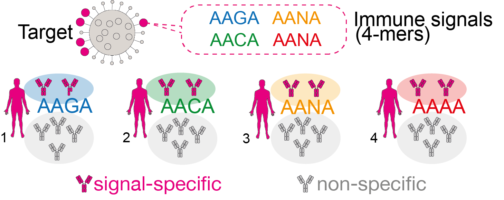
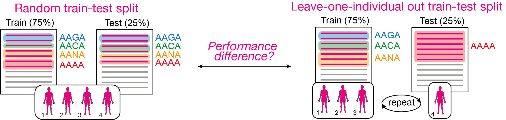

Manuscript use case 1: Out-of-distribution receptor-level simulation using LIgO
============================================================

The composition of train and test data can impact the quality and accuracy of AIRR-ML models. In our use case, we showed how splitting the train and test data may decrease predictive performance in out-of-distribution cases. With LIgO, we simulated a scenario where an immune signal is defined as one motif, but each individual carries a slightly different modification of this motif. 

We trained and evaluated a logistic regression model (LR) for receptor-level classification using two different train-test strategies. The first strategy involved a random split of all AIRs from all individuals into train and test sets, while the second strategy used a leave-one-individual-out approach, placing all AIRs from one individual into the test set and AIRs from the other individuals into the training set. Our findings revealed that LR trained on the random train-test strategy achieved higher balanced accuracy compared to LR trained on the leave-one-individual-out approach. 

In this tutorial, we give an example of a simulation configuration for a single dataset, along with detailed explanations of the parameters in the comments as needed. A detailed description of use case 1 can be found in the LIgO manuscript.

Simulation configuration
------------------------

In this use case, we considered the immune signal as a motif AA-A with four variations — AAAA, AANA, AACA, and AAGA reflecting AIRs from four different individuals. 

Specifically, the configuration below describes the simulation of a dataset consisting of:

- AIRR1: 5000 IGHs containing AAAA + 5000 IGHs without any of the four signal 4-mers;

- AIRR2: 5000 IGHs containing AACA + 5000 IGHs without any of the four signal 4-mers;

- AIRR3: 5000 IGHs containing AAGA + 5000 IGHs without any of the four signal 4-mers;

- AIRR4: 5000 IGHs containing AANA + 5000 IGHs without any of the four signal 4-mers.

.. code-block:: yaml

  definitions:
    motifs:
      motif1:
        seed: AAAA
      motif2:
        seed: AACA
      motif3:
        seed: AAGA
      motif4:
        seed: AANA
    signals:
      signal1:
        motifs:
        - motif1
      signal2:
        motifs:
        - motif2
      signal3:
        motifs:
        - motif3
      signal4:
        motifs:
        - motif4
    simulations:
      sim1:
        is_repertoire: true
        paired: false
        sequence_type: amino_acid
        simulation_strategy: Implanting # use implanting for simulation signal-specific AIRs
        remove_seqs_with_signals: true # remove all 4 signals from the background receptors
        keep_p_gen_dist: false
        sim_items:
          airr1: # repertoire for individual 1
            generative_model:
              default_model_name: humanIGH
              model_path: null
              type: OLGA
            is_noise: false
            number_of_examples: 1 # for demonstration purposes we simulate airr1 1 time
            receptors_in_repertoire_count: 10000 # each AIRR containing 10000 receptors
            signals:
              signal1: 0.5 # 50% of receptors (5000) should contain signal1 (AAAA)
          airr2: # repertoire for individual 2
            generative_model:
              default_model_name: humanIGH
              model_path: null
              type: OLGA
            is_noise: false
            number_of_examples: 1 # for demonstration purposes we simulate airr2 1 time
            receptors_in_repertoire_count: 10000 # each AIRR containing 10000 receptors
            signals:
              signal2: 0.5 # 50% of receptors (5000) should contain signal2 (AACA)
          airr3: # repertoire for individual 3
            generative_model:
              default_model_name: humanIGH
              model_path: null
              type: OLGA
            is_noise: false
            number_of_examples: 1 # for demonstration purposes we simulate airr3 1 time
            receptors_in_repertoire_count: 10000 # each AIRR containing 10000 receptors
            signals:
              signal3: 0.5 # 50% of receptors (5000) should contain signal3 (AAGA)
          airr4: # repertoire for individual 4
            generative_model:
              default_model_name: humanIGH
              model_path: null
              type: OLGA
            is_noise: false
            number_of_examples: 1 # for demonstration purposes we simulate airr4 1 time
            receptors_in_repertoire_count: 10000 # each AIRR containing 10000 receptors
            signals:
              signal4: 0.5 # 50% of receptors (5000) should contain signal4 (AANA)
  instructions:
    inst1:
      export_p_gens: false # we don't need pgens for this use case
      max_iterations: 10000
      number_of_processes: 32
      sequence_batch_size: 100000
      simulation: sim1
      type: LigoSim
  output:
    format: HTML
  
  

Data preprocessing
-----------------

Before applying Logistic regression we additionally preprocessed the LIgO-simulated data the following way:

- We merged AIRR1, AIRR2, AIRR3, and AIRR4 into one dataset (merged.tsv)

- We added two additional columns — **individual** and **signal_label**. The **individual** column indicates the corresponding individual for each AIR. The **individual** column contains values 0 and 1, where 1 represents that an AIR contains any of the signal motifs and 0 otherwise.

Here is an example of a python script which can do the preprocessing described above

.. code-block:: python

  import pandas as pd
  import os
  
  data_path = "path_to_simulated_dataset/inst1/exported_dataset/airr" # path to the LIgO output   
  metadata = pd.read_csv(os.path.join(data_path, "metadata.csv"))  
  merged = pd.DataFrame()
  
  for i in range(4):
      filename = metadata.loc[i, "filename"]
      df = pd.read_csv(os.path.join(data_path, "repertoires", filename), sep='\t')
      df['individual'] = metadata.loc[i, "sim_item"]
      df['signal_label'] = df['signal1'] + df['signal2'] + df['signal3'] + df['signal4']
      merged = pd.concat([merged, df], ignore_index=True)

  # write the result in the merged_airrs.tsv
  merged.to_csv(os.path.join(data_path, "merged_airrs.tsv"), sep='\t', index=False)

ML configuration
--------------------------

We used a logistic regression (LR) model to classify AIRs into signal-specific or non-specific. The LR was trained and tested using two train-test split approaches — (i) random train-test split and (ii) leave-one individual out train-test split, see the illustration below. You can find more details about our usage of LR in the LIgO manuscript.  

The L1-regularized logistic regression on k-mer encoded data is trained used ImmuneML. The configuration for the ML model is shown below (as an example for one dataset). The parameters specification of ImmuneML are extensively documented in the `ImmuneML documentation <https://docs.immuneml.uio.no/latest/>`_.

**Random train-test split strategy**

.. code-block:: yaml

  definitions:
  datasets:
    d1:
      format: AIRR
      params:
        path: merged_airrs.tsv
        is_repertoire: false
        import_out_of_frame: True
        metadata_column_mapping:
          class: signal_label
  encodings:
    4mer:
      KmerFrequency:
        k: 4
        sequence_type: AMINO_ACID
        sequence_encoding: continuous_kmer  # split sequence into overlapping k-mers
        scale_to_unit_variance: True # scale the normalized examples to have unit variance
        scale_to_zero_mean: False
  ml_methods:
    LR: 
      LogisticRegression:
        penalty: l1 
        C: [0.1,0.05,0.01,0.001]
  reports:
    coefs:
      Coefficients:
        coefs_to_plot:
        - n_largest
        n_largest:
        - 25
        name: coefs
  instructions:
    inst1:
      dataset: d1
      labels:
      - signal_label
      assessment:
        reports:
          models:
          - coefs
        split_count: 4
        split_strategy: stratified_k_fold
      selection:
        split_count: 4
        split_strategy: stratified_k_fold
      metrics: [balanced_accuracy, precision, recall]
      optimization_metric: balanced_accuracy
      settings:
      - encoding: 4mer
        ml_method: LR
      refit_optimal_model: false
      number_of_processes: 32
      strategy: GridSearch
      type: TrainMLModel
  output:
    format: HTML

**Leave-one individual out train-test split strategy**

.. code-block:: yaml

  definitions:
  datasets:
    d1:
      format: AIRR
      params:
        path: merged_airrs.tsv
        is_repertoire: false
        import_out_of_frame: True
        metadata_column_mapping:
          signal_label: signal_label
          individual: individual
  encodings:
    4mer:
      KmerFrequency:
        k: 4
        sequence_type: AMINO_ACID
        sequence_encoding: continuous_kmer  # split sequence into overlapping k-mers
        scale_to_unit_variance: True # scale the normalized examples to have unit variance
        scale_to_zero_mean: False
  ml_methods:
    LR: 
      LogisticRegression:
        penalty: l1 
        C: [0.1,0.05,0.01,0.001]
  reports:
    coefs:
      Coefficients:
        coefs_to_plot:
        - n_largest
        n_largest:
        - 25
        name: coefs
  instructions:
    inst1:
      dataset: d1
      labels:
      - signal_label
      assessment:
        reports:
          models:
          - coefs
        split_count: 4
        split_strategy: leave_one_out_stratification
        leave_one_out_config: # perform leave-(subject)-out CV
          parameter: individual
          min_count: 1
      selection:
        split_count: 3
        split_strategy: leave_one_out_stratification
        leave_one_out_config: # perform leave-(subject)-out CV
          parameter: individual
          min_count: 1
      metrics: [balanced_accuracy, precision, recall]
      optimization_metric: balanced_accuracy
      settings:
      - encoding: 4mer
        ml_method: LR
      refit_optimal_model: false
      number_of_processes: 32
      strategy: GridSearch
      type: TrainMLModel
  output:
    format: HTML

Results and ways to increase simulation complexity if required
-----------------

The logistic regressions trained on the random train-test split achieved higher accuracy with a median balanced accuracy of 0.98, and its largest coefficients corresponded to the four signal 4-mers. However, the logistic regression trained on the leave-one individual out train-test split demonstrated lower performance with a median balanced accuracy of 0.67. This shows that while perfect prediction accuracy may be observed with a random split approach, prediction accuracy may appear more limited based on a leave-one-individual-out split strategy.

Since this use case only illustrates the utilization of LIgO for benchmarking and developing AIRR-ML methods, the simulation performed here is very basic. For simplicity, we assumed that each individual contains only one specific 4-mer and any other signal-specific AIRs are removed from the background. To create a more complex simulation, one can utilize the following LIgO options:

- Do not exclude signal-specific receptors from the background. For example, all AIRs containing AAAA, AAGA, AANA, and AACA should be present in the background of 5000 AIRs for each individual with their natural occurrence. To achieve this, set remove_seqs_with_signals to false.

.. code-block:: yaml

  remove_seqs_with_signals: false # keep all signal-specific AIRs in the background receptors

- Explicitly add AIRs containing other signal-specific 4-mers. For example, if an individual carries the signal AAAA, we can also include AIRs containing AAGA, AANA, and AACA to their repertoire. The yaml below demonstrates how to incorporate 1% of these extra signal-specific AIRs for individual 1. 

.. code-block:: yaml

  airr1: # repertoire for individual 1
    generative_model:
      default_model_name: humanIGH
      model_path: null
      type: OLGA
    is_noise: false
    number_of_examples: 1 # for demonstration purposes we simulate airr1 1 time
    receptors_in_repertoire_count: 10000 # each AIRR containing 10000 receptors
    signals:
      signal1: 0.5 # 50% of receptors (5000) should contain signal1 (AAAA)
      signal2: 0.01 # 1% of receptors (5000) should contain signal1 (AACA)
      signal3: 0.01 # 1% of receptors (5000) should contain signal1 (AAGA)
      signal4: 0.01 # 1% of receptors (5000) should contain signal1 (AANA)

